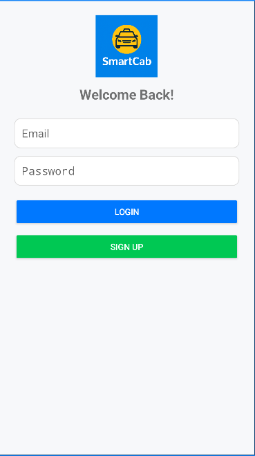
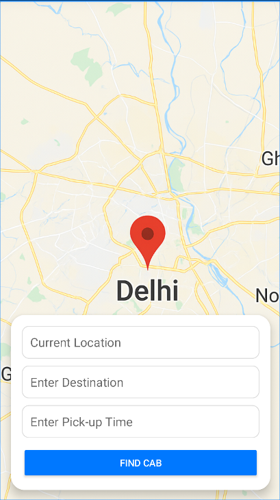

# SmartCab

SmartCab is an Android application built with Kotlin and Jetpack Compose that allows users to book and track cab rides conveniently. The app includes an ML Backend using Flask and K-Means clustering for intelligent ride matching. Features include user authentication, ride booking, real-time tracking, ride history, user profile management, and clustering-based ride suggestions.

## Features

- **User Authentication**: Login and signup functionality for secure access.
- **Ride Booking**: Enter pickup location, destination, and pickup time to find and book a cab.
- **Real-time Tracking**: Track the driver's location and estimated time of arrival (ETA).
- **Ride History**: View past rides and details.
- **User Profile**: Manage personal information and settings.
- **Splash Screen**: Engaging startup experience.
- **ML-Based Ride Matching**: Uses K-Means clustering to group users for efficient ride sharing.

## Screenshots

Here are screenshots of the key screens in the SmartCab Reservation app:

### Splash Screen

*The initial screen displayed when the app launches.*

### Login Screen

*User authentication screen for logging in or signing up.*

### Home Screen

*Main screen for booking rides, entering pickup and destination locations.*

### Ride Details Screen

*Displays estimated fare, time, and distance for the selected ride.*

### Tracking Screen

*Real-time tracking of the driver's location and ETA.*

### History Screen

*View past rides and their details.*

### Profile Screen

*User profile management and settings.*

*Note: Screenshots are placeholders. To add actual screenshots, capture them from the running app in Android Studio or on a device, save them in the `screenshots/` folder in the project root, and update the image paths accordingly.*

## Technologies Used

- **Language**: Kotlin
- **UI Framework**: Jetpack Compose
- **Build Tool**: Gradle (Kotlin DSL)
- **Maps Integration**: Google Play Services Maps
- **Architecture**: MVVM (Model-View-ViewModel)
- **Minimum SDK**: API 24 (Android 7.0)
- **Target SDK**: API 35 (Android 15)
- **ML Backend**: Flask, scikit-learn, numpy

## Dependencies

The app uses the following key dependencies:

- AndroidX Core KTX
- AndroidX Lifecycle Runtime KTX
- AndroidX Activity Compose
- AndroidX Compose BOM (including UI, Material3, etc.)
- Google Play Services Maps
- Material Components
- JUnit and Espresso for testing

For a complete list of dependencies and versions, refer to `gradle/libs.versions.toml`.

### ML Backend Dependencies

- Flask
- scikit-learn
- numpy

For the ML service, refer to `ml_service/requirements.txt`.

## Getting Started

### Prerequisites

- Android Studio (latest version recommended)
- JDK 11 or higher
- Android SDK with API 24+ installed

### Installation

1. Clone the repository:
   ```
   git clone https://github.com/ishant-jaiswal/Smart-cab-Reservation.git
   ```

2. Open the project in Android Studio.

3. Sync the project with Gradle files.

4. Build and run the app on an emulator or physical device.

### Running the ML Backend

1. Navigate to the `ml_service` directory:
   ```
   cd ml_service
   ```

2. Install dependencies:
   ```
   pip install -r requirements.txt
   ```

3. Run the Flask server:
   ```
   python app.py
   ```

The ML service will be available at `http://localhost:5000`.

### Configuration

- Ensure you have a Google Maps API key for map functionality. Add it to your `local.properties` file:
  ```
  MAPS_API_KEY=your_api_key_here
  ```

## ML Backend

The ML Backend is a Flask-based service that provides K-Means clustering for ride matching. It groups users based on their pickup and destination locations, along with pickup time, to suggest efficient ride-sharing options.

### API Endpoint

- **POST /cluster**: Accepts a JSON payload with user data and returns cluster labels.

Example request:
```json
{
  "users": [
    {
      "pickup": [lat1, lon1],
      "dest": [lat2, lon2],
      "time": 1234567890
    }
  ]
}
```

Example response:
```json
{
  "clusters": [0, 1, 2, ...]
}
```

### Code

#### ml_service/app.py
```python
from flask import Flask, request, jsonify
from sklearn.cluster import KMeans
import numpy as np

app = Flask(__name__)

@app.route('/cluster', methods=['POST'])
def cluster_users():
    data = request.get_json()
    users = data.get('users', [])

    if not users:
        return jsonify({'error': 'No user data provided'}), 400

    # Convert user data into numeric array: [pickup_lat, pickup_lon, dest_lat, dest_lon, time]
    X = np.array([u['pickup'] + u['dest'] + [u['time']] for u in users])

    # Run K-Means clustering (3 groups)
    kmeans = KMeans(n_clusters=3, random_state=42)
    labels = kmeans.fit_predict(X)

    # Return cluster labels
    return jsonify({'clusters': labels.tolist()})

if __name__ == '__main__':
    app.run(host='0.0.0.0', port=5000)
```

#### ml_service/requirements.txt
```
flask
scikit-learn
numpy
```

## Project Structure

```
SmartCab/
│
├── app/
│   ├── src/
│   │   ├── main/
│   │   │   ├── AndroidManifest.xml
│   │   │   ├── java/com/example/smartcab/
│   │   │   │   ├── SplashActivity.kt
│   │   │   │   ├── LoginActivity.kt
│   │   │   │   ├── HomeActivity.kt        ← (Main screen where user enters pickup/destination)
│   │   │   │   ├── TrackingActivity.kt
│   │   │   │   ├── RideDetailsActivity.kt
│   │   │   │   ├── ProfileActivity.kt
│   │   │   │   ├── HistoryActivity.kt
│   │   ├── res/
│   │   │   ├── layout/
│   │   │   │   ├── activity_home.xml  ← (UI with map + input)
│   │   │   ├── drawable/
│   │   │   │   ├── map_preview.png
│   │   │   │   ├── ic_cab_logo.png
│   │   │   │   ├── rounded_white_bg.xml
│   │   │   │   ├── edittext_bg.xml
│   │   ├── values/
│   │   │   ├── colors.xml
│   │   │   ├── strings.xml
│   │   │   ├── themes.xml
│   │   │   ├── styles.xml
│   │   └── test/
│   └── build.gradle
│
├── ml_service/
│   ├── app.py                    ← Flask API for K-Means
│   ├── requirements.txt
│
├── build.gradle
├── settings.gradle
└── README.md
```

## Contributing

Contributions are welcome! Please follow these steps:

1. Fork the repository.
2. Create a new branch for your feature or bug fix.
3. Make your changes and test thoroughly.
4. Commit your changes with descriptive commit messages.
5. Push to your fork and submit a pull request.

## License

This project is licensed under the MIT License - see the [LICENSE](LICENSE) file for details.

## Contact

For questions or support, please contact the project maintainer at [ishantjaiswal2004@example.com].

---

*Note: This app is for demonstration purposes and may require additional backend integration for full functionality.*
